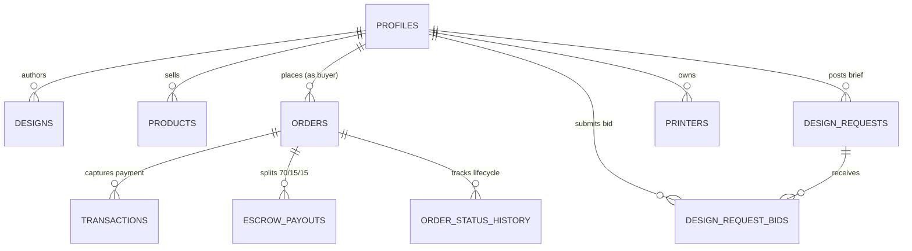

<div align="center">

# ⚡ PrintHive

### *The Decentralized 3-Sided On-Demand 3D Printing & CAD Commerce Ecosystem*

[](https://nextjs.org/)
[](https://react.dev/)
[](https://www.typescriptlang.org/)
[](https://threejs.org/)
[](https://supabase.com/)
[](https://razorpay.com/)
[](https://ai.google.dev/)

[Live Demo](https://printhive-three.vercel.app) • [Browse 3D Models](https://printhive-three.vercel.app/browse) • [Physical Marketplace](https://printhive-three.vercel.app/shop) • [Job Board](https://printhive-three.vercel.app/requests)

---

</div>

## 📌 Executive Summary

**PrintHive** is a full-stack, decentralized additive manufacturing platform designed to solve the structural fragmentation in consumer 3D printing. By interconnecting **Buyers**, **3D CAD Designers**, and **Local 3D Printer Hubs** under a fair, escrow-guarded **70 / 15 / 15** revenue split, PrintHive makes custom physical manufacturing as accessible as e-commerce while monetizing idle 3D printers and rewarding creator intellectual property.

---

## 🚀 Key Architectural Pillars & Features

### 1. 🧊 In-Browser 3D Viewport & Automated Slicer Engine
- Real-time WebGL rendering pipeline built on **Three.js** supporting `.stl`, `.3mf`, and `.obj` formats.
- Interactive OrbitControls, 3D rotation, zoom, wireframe toggle, and hologram laser-scanning shader effects.
- **Mathematical Slicer Engine**: Computes signed polygon volume ($\text{cm}^3$), part mass ($\text{grams}$) using material density constants ($\text{PLA} = 1.24\text{ g/cm}^3$, $\text{PETG} = 1.27\text{ g/cm}^3$, $\text{ABS} = 1.04\text{ g/cm}^3$), and infill multipliers ($15\% \to 100\%$) for instant instant cost estimates without server compute overhead.

### 2. 🗺️ Geospatial Proximity Matching (Leaflet.js & OpenStreetMap)
- GPS-driven spatial dispatch engine that automatically matches buyer orders to the nearest verified 3D printer hub.
- Drastically reduces transit carbon footprint, packaging waste, and multi-day interstate courier delays to same-day/next-day local doorstep delivery.

### 3. 💳 Razorpay Escrow Protection & Automated 70/15/15 Payout Split
- Integrates Razorpay Web SDK with cryptographic **HMAC-SHA256** server-side signature verification.
- Enforces an automated escrow holding contract:
  - **70% Direct Payout** to the 3D Printer Hub Operator for machine time, electricity, and filament.
  - **15% Automated Royalty** to the 3D CAD Designer on every physical print sold.
  - **15% Platform Maintenance Fee** for infrastructure, escrow, and network insurance.
- Funds remain protected in escrow until physical delivery is verified by the buyer.

### 4. 🤖 Google Gemini AI Intelligence Engine
- **Natural Language CAD Discovery**: Translates conversational buyer queries (e.g. *"Print a lightweight shockproof GoPro handlebar mount in PETG"*) into ranked 3D geometry matches.
- **AI Listing Assistant**: Generates technical print recommendations, infill guidelines, and dimensional specifications for newly uploaded CAD files.

### 5. 👥 3-Sided Multi-Role Workspaces & Role-Based Access Control
- Dedicated, responsive dashboards protected by PostgreSQL Row Level Security (RLS) for:
  - **Buyers**: Live order pipelines, custom brief tracking, 3D tool hub, and escrow security center.
  - **3D Designers (Creators)**: Model upload desk, automated royalty revenue analytics, and portfolio metrics.
  - **3D Printer Hub Owners**: Machine queue management, active slice jobs, hardware status, and payout history.
  - **Store Sellers**: Physical product catalog, inventory management, and shipping dispatch.
  - **Platform Administrators**: Dispute resolution, payout clearance, and platform telemetry.

### 6. 💼 Reverse-Auction Bidding & Custom Brief Desk
- Allows buyers to post custom CAD specifications, dimension bounds, and reference photos.
- Verified designers and printer hubs submit competitive turnaround times and price quotations directly to the buyer review desk.

---

## 🛠️ Technology Stack

| Layer | Technologies |
| :--- | :--- |
| **Frontend Framework** | **Next.js 16 (App Router)**, **React 19**, **TypeScript 5** |
| **Styling & UI** | **Tailwind CSS v4**, Lucide React Icons, Modern Glassmorphism System |
| **3D Graphics & WebGL** | **Three.js** (`three`, `@types/three`) |
| **Mapping & Geolocation** | **Leaflet.js** (`leaflet`, `@types/leaflet`), OpenStreetMap Tile Server |
| **Backend & API** | Next.js API Routes (`/api/*`), Node.js Cryptographic Subsystem |
| **Database & Auth** | **Supabase** (PostgreSQL 15 with Row Level Security, `@supabase/ssr`, `@supabase/supabase-js`) |
| **AI Intelligence** | **Google Gemini API** (`@google/genai`) |
| **Payment Gateway** | **Razorpay** Web SDK & REST APIs (HMAC-SHA256 Signature Verification) |
| **Media & File CDN** | **Cloudinary** (Direct & Signed STL/3MF upload presets) |

---

## 🗄️ Database Architecture & Schemas

PrintHive runs on **PostgreSQL hosted via Supabase** with fine-grained **Row Level Security (RLS)** policies ensuring multi-tenant data isolation:



### Core Database Tables:
* **`public.profiles`**: Extended user profiles with role authorization (`buyer`, `designer`, `printer_owner`, `seller`, `admin`).
* **`public.designs`**: Digital 3D CAD repository storing `.stl`/`.3mf` Cloudinary asset URLs, license royalties, and tags.
* **`public.products`**: Ready-made physical 3D printed store catalog with stock levels and delivery SLAs.
* **`public.orders`**: Master purchase records with multi-item payloads, delivery addresses, and payment status.
* **`public.transactions`**: Razorpay transaction logs with `razorpay_order_id`, `razorpay_payment_id`, and `razorpay_signature`.
* **`public.escrow_payouts`**: Immutable 70/15/15 escrow ledger holding and releasing funds to printer hubs and designers.
* **`public.order_status_history`**: State-machine audit trail tracking order milestones (`PENDING_PAYMENT` $\to$ `SLICING` $\to$ `PRINTING` $\to$ `DISPATCHED` $\to$ `DELIVERED`).
* **`public.design_requests`**: Custom modeling & manufacturing requirements posted by buyers.
* **`public.design_request_bids`**: Quotations and turnaround bids submitted by creators and hubs.
* **`public.printers`**: Registered 3D printer fleet with GPS coordinates, nozzle diameters, and supported materials.
* **`public.notifications`**: Real-time user alert dispatch for status changes, bids, and order milestones.

---

## 📂 Project Structure

```
printhive/
├── app/
│   ├── api/                        # Next.js Server API Routes
│   │   ├── auth/callback/          # OAuth & verification callback
│   │   ├── contact/                # Support complaints & tickets
│   │   ├── payments/create-order/  # Server-side Razorpay order init
│   │   ├── payments/verify/        # HMAC-SHA256 signature verification
│   │   ├── payments/refund/        # Disputed order refund processing
│   │   ├── upload/                 # Cloudinary media & CAD file upload
│   │   └── webhooks/razorpay/      # Realtime Razorpay webhook listener
│   ├── browse/                     # 3D CAD Digital Model Repository
│   ├── cart/                       # Shopping Cart with subtotal calculation
│   ├── checkout/                   # Razorpay Payment & Escrow Checkout
│   ├── dashboard/                  # Multi-Tenant Role Dashboards
│   │   ├── admin/                  # Platform Admin Control Center
│   │   ├── buyer/                  # Buyer Workspace & Pipeline
│   │   ├── designer/               # Designer Studio & Royalty Stats
│   │   ├── printer-owner/          # 3D Printer Hub Queue & Payouts
│   │   └── seller/                 # Physical Product Inventory
│   ├── designs/                    # 3D Model Details & Slicing Configurator
│   │   └── [id]/order/             # Custom Slicing & Machine Selection
│   ├── orders/                     # Real-Time Order Tracking Timeline
│   ├── print-on-demand/            # Direct STL Upload & Auto-Slicer
│   ├── printers/                   # Leaflet.js Interactive Printer Hub Map
│   ├── profile/                    # User Profile & Address Manager
│   ├── requests/                   # Custom Brief Bidding Marketplace
│   │   ├── [id]/                   # Proposal Review Desk & Bid Submission
│   │   └── new/                    # Create Technical Custom Brief
│   ├── shop/                       # Physical 3D Marketplace Store
│   ├── support-tickets/            # Customer Support Ticket Resolution
│   ├── layout.tsx                  # Root Layout with Font & Context
│   └── page.tsx                    # Modern Interactive Landing Page
├── components/                     # Reusable SaaS & 3D Components
│   ├── Footer.tsx                  # Standard Footer
│   ├── Hero3D.tsx                  # 3D Orbiting Mesh Canvas Component
│   ├── Navbar.tsx                  # Dynamic Role-Aware Navigation Bar
│   ├── NotificationBell.tsx        # Real-Time Notification Bell
│   └── ThreeViewer.tsx             # Interactive WebGL Model Slicer Viewport
├── lib/                            # Client State & Context Providers
│   └── cart-context.tsx            # Cart & Wishlist LocalStorage Provider
├── utils/                          # Server & Supabase Utilities
│   ├── order-lifecycle.ts          # State-machine transition logger
│   ├── payment-settlement.ts       # Escrow release & payout calculations
│   └── supabase/                   # Supabase SSR & Admin Client Factory
├── middleware.ts                   # Enterprise Security & Route Protection
├── package.json                    # Project Dependencies & Scripts
└── tsconfig.json                   # TypeScript Compiler Configuration
```

---

## ⚡ Getting Started Locally

### 1. Prerequisites
- **Node.js**: `v20.x` or higher
- **npm** / **yarn** / **pnpm** / **bun**
- A **Supabase** account ([supabase.com](https://supabase.com))
- A **Razorpay** account ([razorpay.com](https://razorpay.com))
- A **Cloudinary** account ([cloudinary.com](https://cloudinary.com))
- A **Google Gemini API Key** ([ai.google.dev](https://ai.google.dev))

### 2. Clone the Repository
```bash
git clone https://github.com/princemandal05/printhive.git
cd printhive
```

### 3. Install Dependencies
```bash
npm install
```

### 4. Configure Environment Variables
Create a `.env.local` file in the root directory and populate your credentials (refer to `.env.example`):

```env
# Supabase PostgreSQL & Auth Credentials
NEXT_PUBLIC_SUPABASE_URL=https://your-project.supabase.co
NEXT_PUBLIC_SUPABASE_ANON_KEY=your-anon-key
SUPABASE_SERVICE_ROLE_KEY=your-service-role-secret-key

# Google OAuth Credentials (Optional)
GOOGLE_CLIENT_ID=your-google-client-id
GOOGLE_CLIENT_SECRET=your-google-client-secret

# Cloudinary Media & 3D File Storage
NEXT_PUBLIC_CLOUDINARY_CLOUD_NAME=your-cloud-name
NEXT_PUBLIC_CLOUDINARY_UPLOAD_PRESET=printhive_uploads
NEXT_PUBLIC_CLOUDINARY_PRESET_MODELS=printhive_models
CLOUDINARY_API_KEY=your-cloudinary-api-key
CLOUDINARY_API_SECRET=your-cloudinary-api-secret

# Razorpay Payment Gateway (Test or Live Mode)
NEXT_PUBLIC_RAZORPAY_KEY_ID=rzp_test_your_key_id
RAZORPAY_KEY_ID=rzp_test_your_key_id
RAZORPAY_KEY_SECRET=your-razorpay-key-secret
RAZORPAY_WEBHOOK_SECRET=your-webhook-secret

# Google Gemini AI Intelligence API Key
GEMINI_API_KEY=your-gemini-api-key
```

### 5. Run Database Migrations in Supabase
Navigate to the **SQL Editor** in your Supabase Dashboard and run the SQL migration files provided in the repository:
1. `printhive_payments_schema.sql` (Transactions & Escrow Payouts)
2. `printhive_order_lifecycle_schema.sql` (Order History & Bids)
3. `printhive_printer_owner_schema.sql` (Printers & Hub Fleet)
4. `printhive_notifications_schema.sql` (Notification Dispatch)
5. `printhive_complete_security_rls.sql` (RLS Security Policies)

### 6. Start the Development Server
```bash
npm run dev
```

Open **[http://localhost:3000](http://localhost:3000)** in your browser to view the application.

---

## 🔒 Security & Performance Features

- **Strict Server-Side Validation**: All monetary totals and escrow percentages are strictly computed server-side in Node.js, never trusting client-submitted payloads.
- **Fail-Closed HMAC Verification**: Payment signatures are evaluated using `crypto.timingSafeEqual` to eliminate timing attacks.
- **Enterprise HTTP Headers**: Configured in `middleware.ts` with `X-Frame-Options: DENY`, `X-Content-Type-Options: nosniff`, `Referrer-Policy: strict-origin-when-cross-origin`, and Strict CSP headers.
- **PostgreSQL Row Level Security (RLS)**: Enforces role isolation across multi-tenant user workspaces.

---

## 📄 License

This project is licensed under the **MIT License**. Feel free to use, customize, and extend for your own commercial or academic 3D printing applications.

---

<div align="center">
  <sub>Built with ❤️ by Prince Mandal • Empowering the Future of Distributed 3D Manufacturing</sub>
</div>
